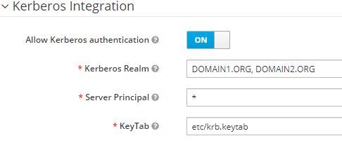
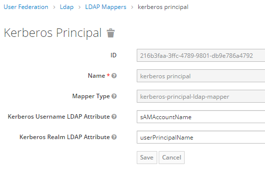
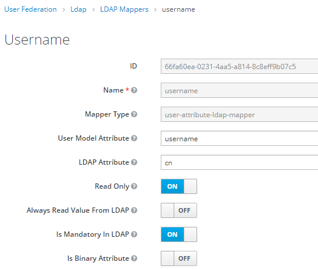

# Провайдер "keycloak-md-ldap-federation" для Keycloak  


Штатный провайдер "LDAP User Federation" (LDAPFederationProvider), на практике работает только
если создана одна настройка "LDAP User Federation". Т.о. позволяет аутентифицировать по Kerberos 
пользователей из разных Kerberos-доменов только в одной конфигурации, когда домены имеют взаимное доверие 
и есть общий Global LDAP-каталог, агрегирующий каталоги всех доменов.
   
Данный провайдер аналогичен "LDAP User Federation", но поддерживает несколько настроек "LDAP User Federation" и
конфигурацию, когда пользователи, аутентифицирующиеся в Keycloak по Kerberos, находятся в независимых доменах.
Global LDAP-каталог также не требуется. 

>**ВНИМАНИЕ**: Данный провайдер замещает штатного LDAPFederationProvider провайдера (с идентификатором 'ldap'). Так что
ранее настроенная интеграция с LDAP через LDAPFederationProvider может изменить своё поведение. 
Поведение KerberosFederationProvider (с идентификатором 'kerberos') останется без изменений.


## Настройка

Следуйте [официальной инструкции](https://www.keycloak.org/docs/latest/server_admin/#setup-and-configuration-of-keycloak-server). 
Для правильной работы данного провайдера есть дополнительные требования:

**1)** Во всех настройках "LDAP User Federation" в разделе "Kerberos Integration" должны быть указаны 
одинаковые значения: 
- `Server Pricipal` = `*` (звезда)
- `KeyTab`=`<file>` (один общий KeyTab файл)



>**Примечание**. В текущей версии Keycloak (11.0.2) на этапе Kerberos-аутентификации применяется только одна настройка
"LDAP User Federation", имеющая наименьший приоритет. Значения этих 2 полей в других настройках значения не имеют.

**2)** В настройке "LDAP Kerberos Integration" в поле `Kerberos Realm ` через "`,`" (запятую) перечисляются AD-домены,
 учётные данные пользователей которых будут считываться из данного LDAP-каталога или записываться в него. 
 Один домен может присутствовать в нескольких настройках "LDAP User Federation". Если пользователь отсутствует
 в хранилище Keycloak, то берутся "LDAP User Federation" соответствующие домену пользователя и в порядке приоритета от
 наименьшего до первого успеха производится попытка считывания учётки в соответствующих LDAP-каталогах.
 Если учётка пользователя уже загружена в хранилище Keycloak из одного из LDAP-каталогов ранее, то она актуализируется 
 по LDAP-каталогу из которого была изначально загружена. Первичная загрузка учётки может произойти в результате 
 синхронизации по расписанию, настроенной в "LDAP User Federation" или при запуске синхронизации в ручную по кнопке
 "Synchronize all users" или "Synchronize changed users" в "LDAP User Federation". 

**3)** В настройке "LDAP User Federation" должен быть мэппер типа `kerberos-principal-ldap-mapper` для сопоставления
LDAP-атрибутов с идентификатором пользователя в токене Kerberos.



В конфигурации мэппера в поле `Kerberos Username LDAP Attribute` указывается имя LDAP-атрибута,
содержащего часть с именем пользователя.
Берётся часть слева от `@` в значении LDAP-атрибута, либо значение полностью, если символ `@` отсутствует в значении. 
Для AD имя LDAP-атрибута ДОЛЖНО быть `sAMAccountName`, поскольку в токенах Kerberos (TGT, ST),
выданном KDC Active Directory, идентификатор пользователя имеет формат
```
sAMAccountName@domain
```    
В поле `Kerberos Realm LDAP Attribute` указывается имя LDAP-атрибута, содержащего часть с именем домена.
Берётся часть справа от `@` в значении LDAP-атрибута. 
Для AD имя LDAP-атрибута может быть `userPrincipalName`.

Для провайдера ApacheDS значением обоих полей должно быть `krb5PrincipalName`.
 
Если при создании настройки "LDAP User Federation" провайдером указано Active Directory и включена
интеграция с Kerberos, то мэппер типа `kerberos-principal-ldap-mapper` будет создан автоматически. 

**4)** В качестве уникального имени пользователя в Keycloak (значение поле "User name") при импорте из LDAP
используется значение из атрибута, заданного в поле `Username Attribute in LDAP` в настройке "LDAP User Federation".
Имя атрибута указанного в поле `Username Attribute in LDAP` ДОЛЖНО совпадать со значением поля `LDAP Attribute`
в мэппере типа `user-attribute-ldap-mapper` со значением `username` в поле `User Model Attribute`.

Если при создании настройки "LDAP Kerberos Integration" в качестве провайдера указано "Active Directory",
то такой мэппер будет добавлен автоматически под именем "username".   



>**Важно.**
>
>Если "Authentication Flow" допускает, что пользователи могут аутентифицироваться не только через
>Kerberos, то уникальные имена пользователей, импортированные из разных LDAP-каталогов, должны оказаться уникальными
>среди всех учётных записей в Keycloak.
  
**5)** В общем файле KeyTab должны быть ключи для SPN (Service Principal Name) всех доменов.
 
**6)** Обязательно должен быть указан Kerberos реалм по-умолчанию. Либо через системное св-во
 [java.security.krb5.realm](https://docs.oracle.com/javase/8/docs/technotes/guides/security/jgss/tutorials/KerberosReq.html),
  либо в файле krb5.conf. В случае Keycloak это имя домена может быть произвольным.
```
[libdefaults]    
	default_realm = ANY
```
 
 
## Установка провайдера в Keycloak
  Следуйте [официальной инструкции](https://www.keycloak.org/docs/latest/server_development/#registering-provider-implementations).
  Самый простой способ - это  поместить jar-файл провайдера в папку `standalone/deploymens` Keycloak.

> **Важно** Данный провайдер должен запускаться после штатного LDAPFederationProvider. 
 
## Примечания

**1)** SPN (имя сервиса) привязываемое к учётке в AD для Keycloak должно иметь формат:
```
HTTP/<DNS-имя сервера Keycloak>
```
В качестве `DNS-имя сервера Keycloak` нельзя указывать IP. UPN имя учётки должно иметь формат:
```
HTTP/<DNS-имя сервера Keycloak>@<имя домена>
```

**2)** Чтобы не импортировать системные учётные записи Active Directory в "Custom LDAP users filter" рекомендуется добавить условие:
``` 
 (!(isCriticalSystemObject=TRUE))
```

**3)** 
[Статья, как выпускать keyTab для нескольких SPN.](https://blog.it-kb.ru/2017/03/24/how-to-create-keytab-file-with-additional-kerberos-service-principal-on-windows-server-and-linux/)
  
Уточнение по KVNO в KeyTab. KVNO (Key Version Number) используется при поиске ключа в KeyTab, соответствующего
предоставленному ST (Service Ticket), тоже содержащему свой KVNO. Обозначим KVNO в KeyTab как kv, а KVNO в ST как stv.
При поиске ключа в KeyTab, по порядку перебираются ключи, соответствующие запрошенному алгоритму шифрования.
Берётся первый ключ, удовлетворяющий нижеследующим условиям в порядке приоритета:
- kv=0 ИЛИ stv=0
- kv=stv
- Наибольшее kv

**4)** Параметры JVM для включения протоколирования процедуры Kerberos-аутентификации и диагностики проблем:
```
-Dsun.security.krb5.debug=true
-Dsun.security.spnego.debug=true 
-Dsun.security.jgss.debug=true
-Djava.security.debug=gssloginconfig,configfile,configparser,logincontext
```   
**5)** Keycloak под капотом использует Krb5LoginModule [[ссылка RU]](http://spec-zone.ru/RU/Java/Docs/8/jre/api/security/jaas/spec/com/sun/security/auth/module/Krb5LoginModule.html),
[[ссылка EN]](https://docs.oracle.com/javase/8/docs/jre/api/security/jaas/spec/com/sun/security/auth/module/Krb5LoginModule.html).
Который конфигурируется файлом krb5.conf [[ссылка EN]](http://web.mit.edu/kerberos/krb5-1.12/doc/admin/conf_files/krb5_conf.html).
Правило поиска krb5.conf [[ссылка EN]](https://docs.oracle.com/javase/8/docs/technotes/guides/security/jgss/tutorials/KerberosReq.html). 
 
**6)** [Описание протокола Kerberos](https://techcommunity.microsoft.com/t5/ask-the-directory-services-team/kerberos-for-the-busy-admin/ba-p/395083)